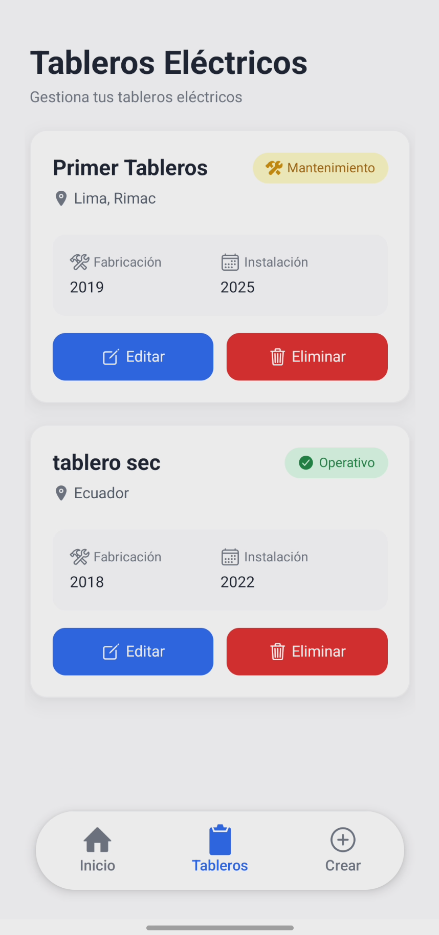
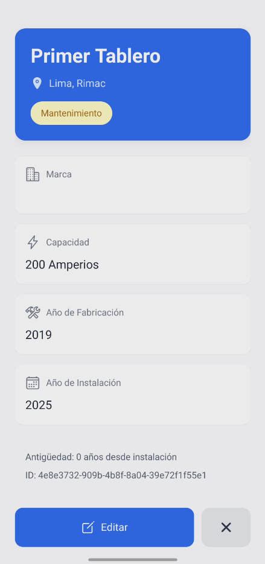
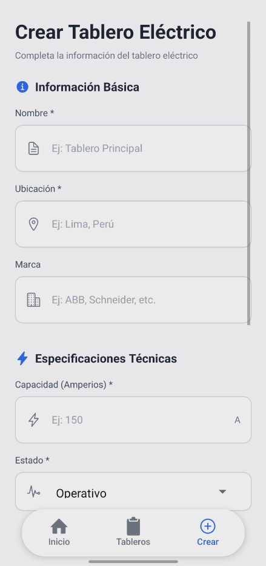
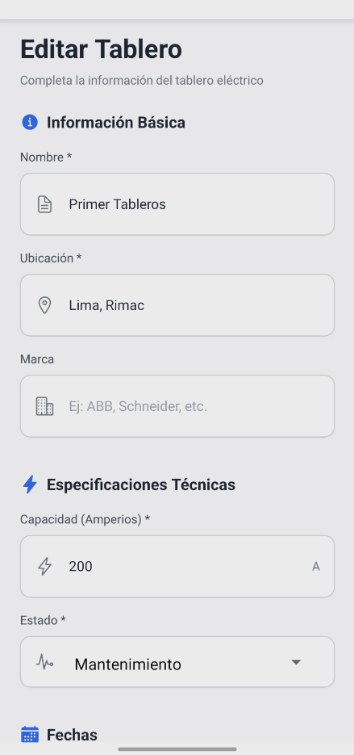

# 📱 Gestión de Tableros Eléctricos

> Aplicación móvil para la gestión y monitoreo de tableros eléctricos industriales

[](https://reactnative.dev/)
[](https://expo.dev/)
[](https://www.typescriptlang.org/)
[](https://tailwindcss.com/)

<div align="center">
  
</div>

## Descripción del Proyecto

   Aplicación móvil desarrollada con React Native y Expo que permite la gestión completa de tableros eléctricos industriales. La app facilita el registro, visualización, edición y eliminación de tableros, incluyendo sus especificaciones técnicas, fechas de fabricación/instalación, y estado operativo.

### ✨ Características Principales

- ✅ **CRUD Completo**: Crear, leer, actualizar y eliminar tableros eléctricos
- 📊 **Listado Interactivo**: Vista de tarjetas con información resumida y estados visuales
- 🔍 **Vista Detallada**: Pantalla dedicada con toda la información del tablero
- ✏️ **Formularios Validados**: Validación robusta con Formik + Yup
- 🎨 **UI/UX Moderna**: Diseño intuitivo con TailwindCSS (NativeWind)
- ⚡ **Gestión de Estado**: React Query para manejo eficiente de datos
- 📱 **Responsive**: Optimizado para diferentes tamaños de pantalla
- 🔔 **Confirmaciones**: Modales de confirmación para acciones críticas

## 🛠️ Stack Tecnológico

### Core
- **React Native** `0.76.5` - Framework móvil multiplataforma
- **Expo** `~54.0.23` - Plataforma de desarrollo
- **TypeScript** `5.9.2` - Tipado estático
- **Expo Router** `6.0.14` - Navegación basada en archivos

### Gestión de Estado y Datos
- **@tanstack/react-query** `5.90.9` - Manejo de estado del servidor
- **Formik** `2.4.6` - Gestión de formularios
- **Yup** `1.6.4` - Validación de esquemas

### UI/UX
- **NativeWind** `4.2.1` - TailwindCSS para React Native
- **@expo/vector-icons** - Iconografía (Ionicons)
- **@react-native-picker/picker** `2.11.1` - Selectores nativos

### Desarrollo
- **ESLint** `9.17.0` - Linting


## 📂 Estructura del Proyecto

```
rems-tableros-frontend/
├── app/                          # Navegación (Expo Router)
│   ├── (tabs)/                   # Tabs principales
│   │   ├── index.tsx            # Home/Perfil
│   │   ├── tableros.tsx         # Lista de tableros
│   │   └── crear.tsx            # Crear tablero
│   ├── editar-tablero/
│   │   └── [id].tsx             # Editar tablero (dynamic route)
│   └── detalle-tablero/
│       └── [id].tsx             # Detalle del tablero
├── components/                   # Componentes reutilizables
│   ├── form/
│   │   ├── tablero-form.tsx     # Formulario principal
│   │   ├── validation.ts        # Esquema de validación Yup
│   │   └── types.ts             # Tipos del formulario
│   ├── tableros-card.tsx        # Tarjeta de tablero
│   ├── confirm-delete-modal.tsx # Modal de confirmación
│   └── profile-card.tsx         # Tarjeta de perfil
├── hooks/                        # Custom hooks
│   ├── useTableros.ts           # Hook para CRUD de tableros
│   └── useCrearTableros.ts      # Hook para creación
├── api/                          # Servicios API
│   └── tableros.service.ts      # Llamadas al backend
├── types/                        # Definiciones de tipos
│   └── tablero.tsx              # Interfaz Tablero
└── theme/                        # Configuración de tema
    └── colors.ts                # Paleta de colores

```

## Funcionalidades Implementadas

### 1. Gestión de Tableros
- **Crear**: Formulario completo con validación de todos los campos
- **Listar**: Vista de tarjetas con información clave y navegación
- **Ver Detalle**: Pantalla dedicada con toda la información
- **Editar**: Modificación de tableros existentes con validación
- **Eliminar**: Confirmación mediante modal antes de eliminar

### 2. Validación de Formularios
- Campos requeridos: nombre, ubicación, capacidad, estado, años
- Campo opcional: marca
- Validación de años: año de instalación ≥ año de fabricación
- Validación numérica para capacidad en amperios
- Mensajes de error contextuales

### 3. UI/UX
- Diseño moderno con esquema de colores coherente
- Iconografía consistente en toda la aplicación
- Estados visuales (Operativo, Mantenimiento, Inactivo)
- Feedback visual para acciones del usuario
- Modales para confirmaciones críticas

## Integración con Backend

La aplicación se conecta a una API REST para la gestión de tableros. El servicio está configurado en `api/tableros.service.ts`:

```typescript
const API_URL = 'https://rems-tableros-backend.onrender.com/api/tableros'
```

### Endpoints Utilizados
- `GET /api/tableros` - Listar todos los tableros
- `GET /api/tableros/:id` - Obtener un tablero específico
- `POST /api/tableros` - Crear nuevo tablero
- `PUT /api/tableros/:id` - Actualizar tablero
- `DELETE /api/tableros/:id` - Eliminar tablero

## 📸 Capturas de Pantalla

<div align="center">
  <table>
    <tr>
      <td align="center">
        
        <br />
        <b>Vista de Lista</b>
        <br />
        <sub>Tableros con información resumida y acciones rápidas</sub>
      </td>
      <td align="center">
        
        <br />
        <b>Detalle del Tablero</b>
        <br />
        <sub>Información completa con especificaciones técnicas</sub>
      </td>
    </tr>
    <tr>
      <td align="center">
        
        <br />
        <b>Crear Tablero</b>
        <br />
        <sub>Formulario con validaciones en tiempo real</sub>
      </td>
      <td align="center">
        
        <br />
        <b>Editar Tablero</b>
        <br />
        <sub>Modificar información con validación completa</sub>
      </td>
    </tr>
  </table>
</div>

